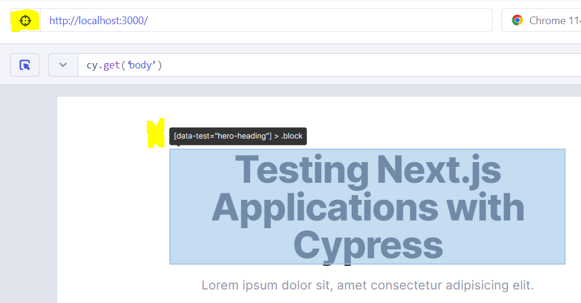
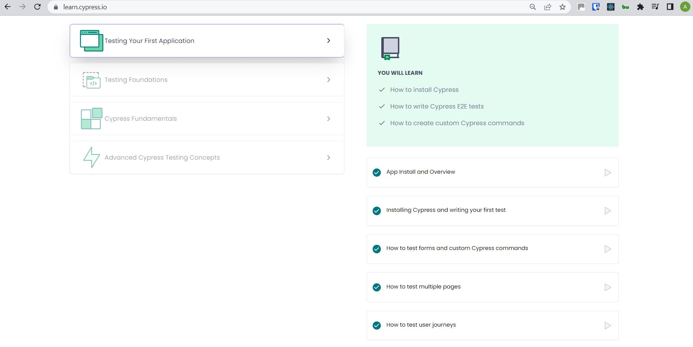
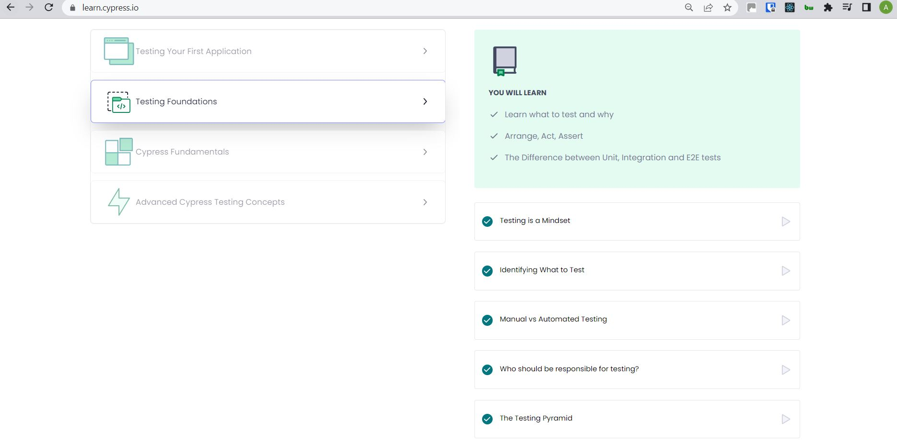
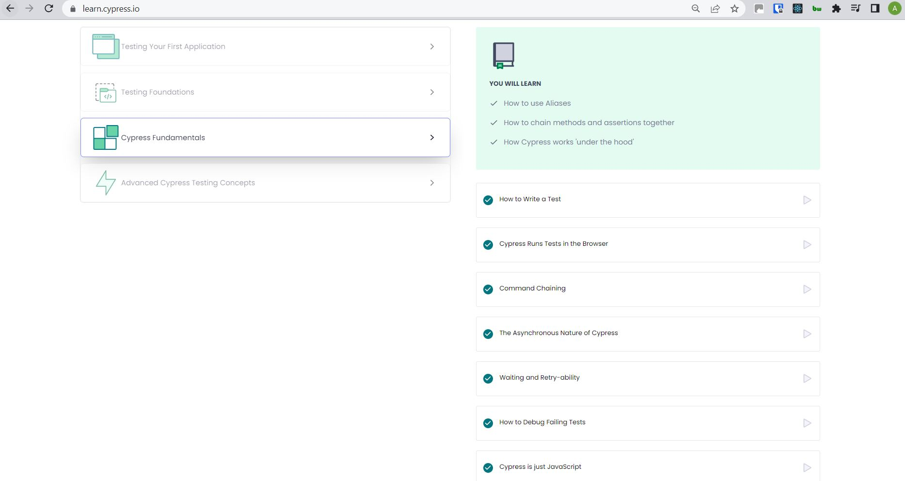
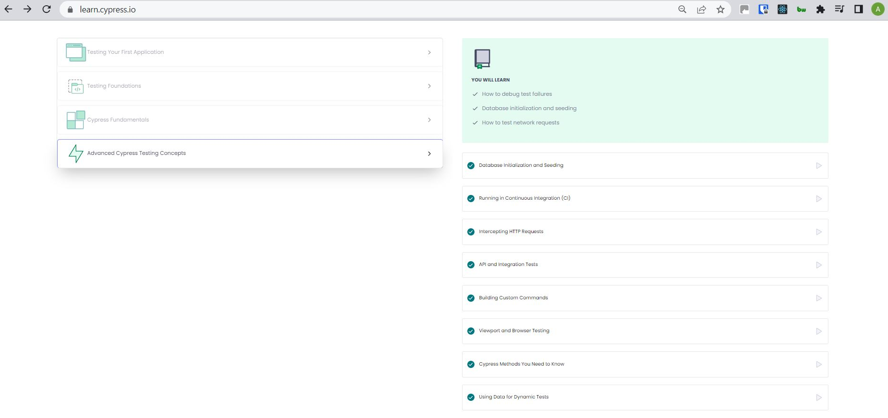

# Real World Testing with Cypress - Course App

This application is for the [Testing your first application course](https://learn.cypress.io/testing-your-first-application) on [learn.cypress.io](https://learn.cypress.io/).

The `start` branch is the main branch for this repo and is the starting point for the course. The [final](https://github.com/cypress-io/cypress-realworld-testing-course-app/tree/final) branch contains the completed tests.

The `develop` branch contains further tests across the full application: [develop branch](https://github.com/cypress-io/cypress-realworld-app/tree/develop).

## My Notes

### Running your tests

You'll need to run the app in one terminal window, and Cypress in another. The command to run Cypress is `npx run cypress`

### Running a single test

Add only to the test - IE. it.only - and when you save Cypress will only run that test.

### Data-test attributes

Rather than targetting things off their element type or class/ID, best practise is to use the data-test attribute, which is only used in Cypress testing and won't change when you update styling in your app.

You find these by clicking the target-looking button in the test-runner window (selector playground): .

Sometimes you don't have access to these - for example if using third party libraries - so then you need to work around. The following links have reference material as it's not a straight-forward thing:

[Cypress Learn - 'Using only to run a single test'](https://learn.cypress.io/testing-your-first-application/installing-cypress-and-writing-your-first-test)

[Cypress Docs - Selecting Elements](https://docs.cypress.io/guides/references/best-practices#Selecting-Elements)

### Commands

`.contains` is case sensitive
`.find` limits the scope of where Cypress will look for an element IE it will only look inside another specified element
`.eq` shorthand for equals
`.wait` allows you to add some wait time between commands and can prevent a test from falling over if it's failing because something is taking too long. This isn't mentioned in the course but I found reference to it when I was investigating why the code from the course was failing the userJourney test. This shouldn't happen [see here](https://learn.cypress.io/cypress-fundamentals/waiting-and-retry-ability) but as my code matched the tutorial, I suspect it was something in the application files that was buggy and causing a problem.

Cypress commands don't return their subjects, which is one reason they do NOT recommend using variables within tests.

[Cypress Docs - Commands](https://docs.cypress.io/api/table-of-contents)

### Custom commands

These have to be created in `cypress/support/commands.ts`

### Hooks

`beforeEach` - allows you to make code more DRY and is setup before each (ha) test.

### Context

Context allows you to wrap all the tests relating to the same section together within your spec file, to keep your tests readable and searchable.

It will also group the tests under those headings in the test runner so you can more easily see what's going on.

### Mocha

Cypress is built on Mocha, and all commands that don't start `cy.` are from Mocha - this may help in the future when looking at using the correct thing.

### Courses included (and completed)

